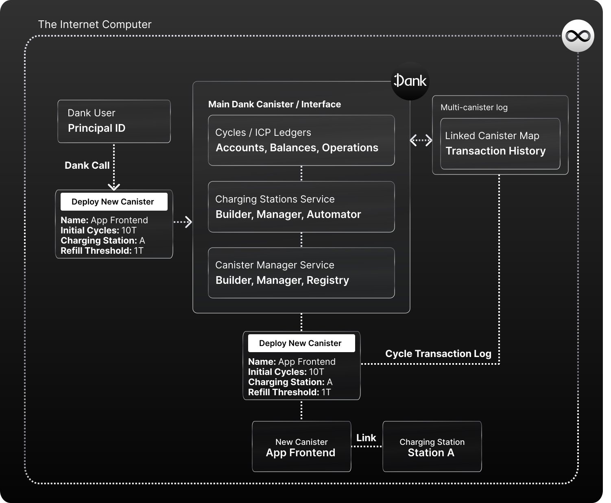

# Canister Management in Dank

Dank's Canister Manager service offers an abstracted way of doing proxied calls to the Internet Computer to build, deploy, and manage Canisters; as well as a per-account record of owned Canisters that allows users to carry their canisters with them into any interface they might use to manage/build them.

With the Cycles Ledger, Dank creates a seamless ecosystem that simplifies all cycles transactions, so it seemed only natural to help users integrate all cycle-related use cases with their balances. Building, deploying, and fueling canisters is one of those use cases.

**Reference Implementation:**
[Fleek.ooo](https://fleek.ooo/) is a platform that leverages Dank's charging station and canister management features to provide an Open Internet Service around development on the Internet Computer; where by offering a seamless management of canisters/charging stations, it simplifies how developers can build and host apps, infrastructures, websites, or databases on the Internet Computer.

## An Abstraction & Unification Layer

Through Dank, any user can use Main Dank's API to build, deploy, or manage their canisters easily, and have them interact with their Cycles balances in the Dank Cycles Ledger to power their functioning.

In this case, Dank acts like an orchestrator and abstraction layer. Through simple API calls, anyone can deploy/manage a canister, while Dank handles proxying the calls to the Internet Computer network.

From a end-user perspective, it makes canister development as easy as it gets, because you have a direct line of communication with your cycles, and you can use simple commands and let Dank do the heavy lifting; from a developer perspective, it gives any Internet Computer app plug-in canister management features they can surface in their UI to all their users, by interacting with Dank's API.

### The Dank Canister Registry

**Dank also keep a registry of each users' owned canisters**, which gives users and their Principal IDs more visibility and control over their canisters, which they can now carry across interfaces.

If you were to deploy and manage a canister through Dank, and then log into a different Dank-integrated IC app for canister management (like Fleek.ooo!), the app could surface your Dank-deployed canister records automatically, and allow you to view and manage your canisters there without any migrations or manual work. With Dank, canisters can become an **interface agnostic asset** that you can resurface and manage from any interface or app.