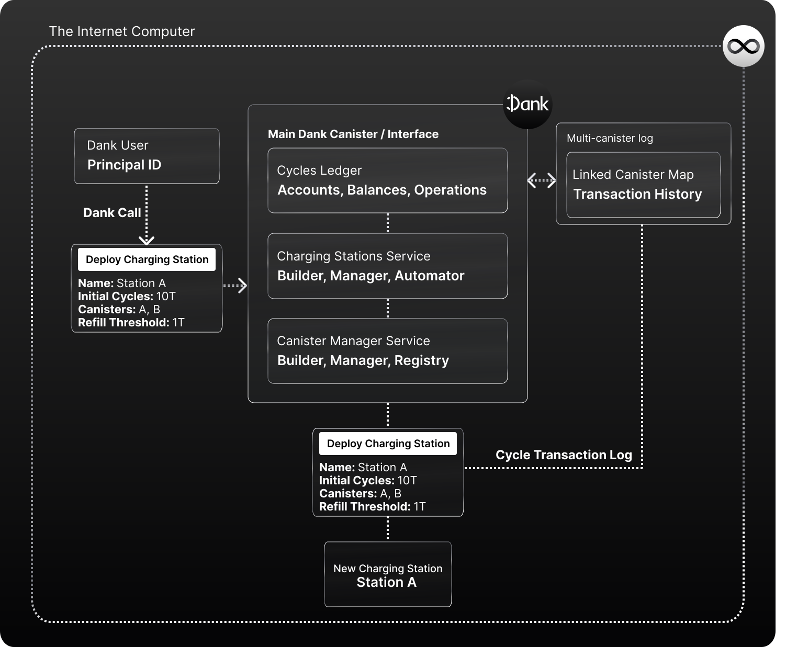

# Charging Stations in Dank

Canisters on the Internet Computer need cycles to power the software in them constantly. One can refill them with Cycles manually, or use charging stations.

Charging Stations are canisters on the Internet Computer with the sole purpose of sending Cycles to *other* canisters in a programmatic way, so that they can be refilled as needed without constant manual transactions. 

Normally, any developer would have to manually develop a charging station, deploy it themselves to the Internet Computer, and refill them constantly with cycles from their Cycles Wallet.

Dank has a specific service (the Charging Stations API), that provides Dank Accounts with abstracted and simple tools to deploy and automate charging stations, connect them with the canisters they deployed through their Dank Accounts, and the Cycles in their balances.

It also enables **the automation of certain aspects of charging stations** that would otherwise be impossible, or manual, like setting automatic refill thresholds for canister and stations.

**We built a Charging Station framework** to achieve this, that interacts seamlessly with Dank and its users. However, anyone can use this framework, outside of Dank, to have a much better experience and workflow when it comes to Charging Station building and management.

**Reference Implementation:**
[Fleek.ooo](https://fleek.ooo/) is a platform that leverages Dank's charging station and canister management features to provide an Open Internet Service around development on the Internet Computer; where by offering a seamless management of canisters/charging stations, it simplifies how developers can build and host apps, infrastructures, websites, or databases on the Internet Computer.

## Creating Charging Stations Through Dank

Through the **Charging Stations builder API**, Dank Accounts can use a simple API call to:

- Create, configure, and deploy a new Charging Station to the Internet Computer.
- Assign canisters to a station, so that they can receive/request cycles from it.
- Automate and control the refill amounts that both the Charging Station can request to the main Dank Account's balance, and that the Canisters associated to that Station can request to the station itself.

All of this, without the need of manually coding or designing the Charging Station itself, since Dank does the heavy lifting. Developers need only to set the parameters, and Dank will handle the rest.

This level of abstraction helps make charging stations universally accessible to anyone, and simplifies development on the Internet Computer; whether it is by giving developers a ready-to-go solution, or by allowing any Internet Computer application to **integrate this feature to their UI** to convert it into a simple browser/app interface experience.

## Automation & Thresholds

Dank's implementation of Charging Stations, together with the cycles finance ecosystem Dank Accounts have access too, allow it to add **more features to charging stations in the shape of thresholds and refill automations**.

Through the Charging Stations API, users can configure:

- **Per-canister cycles refill request thresholds:** The cycles balance a canister has to reach to request more cycles to the station.
- **Per-canister cycles refill amount:** The amount of cycles a canister can request from a station.
- **Per-station cycles refill request thresholds:** The cycles balance a **station** has to reach to request more cycles to your Dank Account.
- **Per-station cycles refill amount:** The amount of cycles a **station** can request from your wallet when low on balance.

This eliminates several manual aspects of Charging Station and Cycles Management for any canister developer; and provides a layer of control over the cycle consumption in the Dank Account.