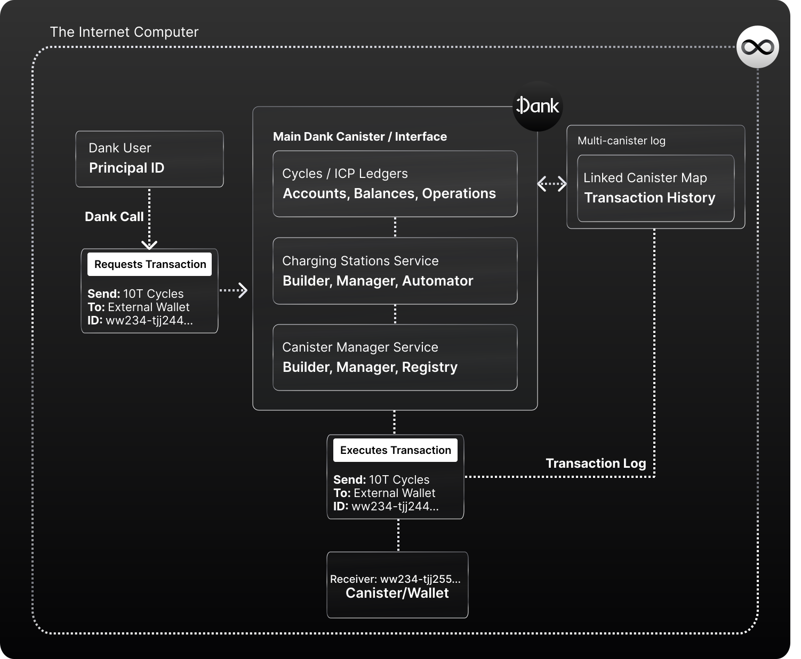

# Dank's Cycle-based Finances

The core functioning of Dank is acting as a decentralized  bank for the Internet Computer, allowing Principal IDs to hold cycles without needing a separate Cycles Wallet.

In a nutshell, with Dank we created a Cycles Ledger so that a user can hold them and interact with them using nothing but a Principal ID. Dank’s Cycles Ledger holds cycles in an auto-scalable, autonomous, multi-canister infrastructure, and maps the balances to each user’s Principal ID, using big-map to track each associated balance. This way, we abstract the need of using a Cycles Wallet (canister that holds cycles for users), and managing a separate ID to hold cycles.

Cycles are just the beginning. We are looking forward to creating a solution for ICP to also allow users to hold ICP with just a Principal ID; and we have already **agreed with the community on a new standard, using Principal IDs as unique identifiers on the network**, that would also enable anyone in the future to use a universal token interface to create tokens and token ledgers that any user can hold/own with just a Principal ID. Because, as of today, custom tokens or ICP can't be held by Principal IDs, and require users to manage a separate unique identifier called "Account ID" that is token specific.

Dank's Ledgers and new token standard creates a finances ecosystem within the protocol in which Dank can provide users with streamlined cycles operations. Through Dank, any user can:

- Send or receive cycles across Principal IDs (Dank users).
- Send or receive cycles to any external recipient (canisters or Account IDs).
- Use cycles inside of Internet Computer applications.

These operations are called via the Ledger's API, whether it is directly through that interface, or via a Dank-integrated IC application that leverages said interface to offer the features via a one-click UI/app.

Dank is an autonomous Open Internet Service without external control, meaning all of these operations are handled trustlessly by the protocol, and in sole reaction to the user's requests and actions.

## How do Dank's Ledgers work?

The ledgers are composed by two main pieces.

Firstly, the **main Dank Canister**. This piece is in charge of storing large amounts of cycles for all registered users, keeping track of each individual balance by registering their Principal IDs, and using big-map to keep track of the amount that corresponds to each ID. It's the main interface/API from where users can interact and perform cycle-related actions with their balances.

Secondly, **multi-canister infrastructure**, a sub-set of canisters inside the ledger keeps track of transactions.

## Dank's Universal Canister ID

The Main Dank Canister **also acts as a universal Canister ID** for all users. What do we mean by this? When developing or navigating the Internet Computer, you may encounter the need to use cycles. When you do so, the balance comes from a Cycles Wallet (because Principal IDs can't hold cycles) which you specify with a Canister ID. 

For example, when deploying a canister using the Canister SDK, you must set a default wallet from where the cycles to be consumed will be spent.

In the case of Dank Accounts, that Canister ID is **universal**, since Dank is the 'Cycles Wallet' of all Dank accounts (like a decentralized bank!).

This is the **main objective of the Cycles ledger**. Without the Cycles Ledger, a user's Cycles Wallet ID and Principal ID are separate addresses. Meaning their Cycles are not only separate from their main identity, but from their other assets (ICP, Neurons, etc.).

With Dank, a user's Principal ID references their cycles on Dank's ledger; and when authenticating into any app **they don't need to worry about authenticating a Cycles Wallet ID each time**, because the application can authorize the main Dank Canister ID every time, and Dank will in turn return that specific user's cycles balance. This also means users can **send Cycles to other Principal IDs, without needing the other user's Cycles Wallet ID!**, simplifying the experience greatly.