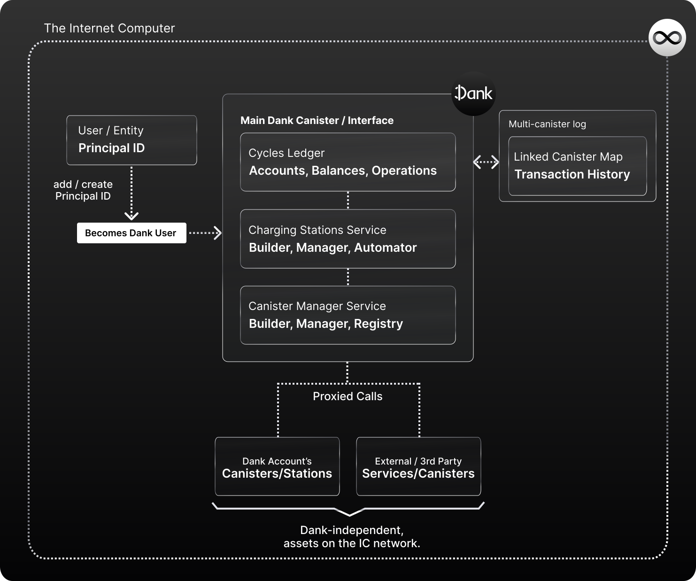

# What are Dank Users / Accounts?

Dank Users are Principal IDs that access to Dank's Open Internet Service. A user can ask Dank for a new Principal ID, or add their own.

Dank gives Principal IDs the capability of becoming a versatile and powerful 'main account' for users on the Internet Computer. How? By having Dank combine the features in finances, development, and identity into one seamless, abstracted environment, managed by a decentralized and trustless protocol (Dank).

In contrast to a regular Principal ID, Dank users **don't require** a separate Cycles Wallet to hold cycles or Account IDs to hold NNS tokens like ICP/Neurons; and all utilize the same universal Canister ID, which is Dank's main canister ID to reference their balances. This is thanks to **Dank's Cycles & ICP ledger**, as well as the use of a new community-agreed token standard that focused on Principal IDs as a main address (identity+wallet) for users on the Internet Computer; instead of the native multi-address approach where user accounts across the network would be device/app specific, with different IDs for different assets.

By centralizing tokens back into Principal IDs, Dank eliminates the friction of having to manage a separate wallet; and with that, it unlocks the possibility of Principal IDs that can:

- Sign-in/onboard into IC apps with their cycles or balances in one step.
- Automate cycles operations across different IC assets (canisters, charging stations).
- Perform cycle-related actions (like deploying a canister) from abstracted interfaces.
- Surface and manage their canisters anywhere, as each account keeps a record of the canisters they own.

In a similar fashion, Dank can surface all these features for developers to offer to users; providing a ready-to-go ecosystem of tools FOR financial services, or cycle-related use cases like canister development, that anyone can surface in-app via simple API calls.

## What do Dank Users have access to?

Principal IDs in Dank get access to the entire suite of services. They are automatically registered in Dank's **Cycles and ICP Ledgers**, so that they can own a balance on the ledger which the Dank protocol holds for them to allow the user to surface them as a token, and operate with them directly from their Principal IDs.

Overall, the main benefit of becoming a Dank user is centralizing the management of the core aspects of your IC experience (cycles, tokens, assets, canisters, etc.) from a single space that is built to have them interact with each other seamlessly.

For example, a Dank user can easily swap ICP for cycles, use them to deploy a canister, create and configure and auto-refill charging station, and fuel their canisters, all from the same account, and through Dank's API or any integrated application's UI. Or, if an application like Open Chat or DSCVR were to integrate Dank, users could use the same Principal ID as their identity across both apps, bringing their token balances into both apps without having to manage different addresses or identities.

## Are a user's cycles, ICP, or tokens in Dank exclusive to the Dank ecosystem?

No. Dank extends a Principal IDs functionality and connects it to abstracted tools, but the core of the account continues to be a regular Principal ID.

That Principal ID resides on the Internet Computer, and is owned by the user.

Dank users are just a Principal ID, and can be utilized on developer tools like DFINITY's Canister SDK DFX CLI tool, with the difference that a user will set Dank's Universal Canister ID address as their default wallet for that principal on the CLI.