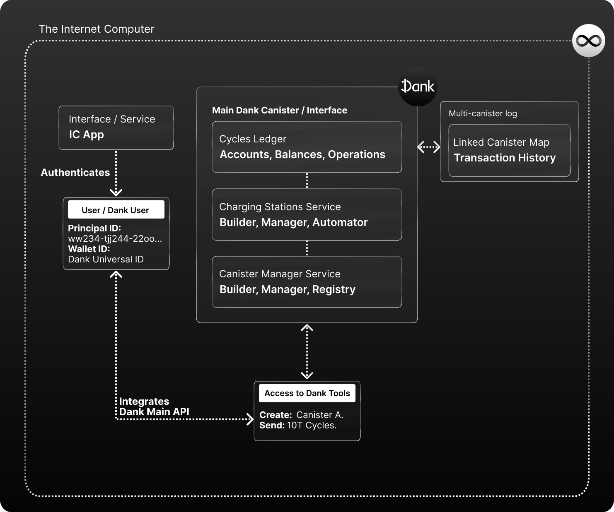

# Seamless IC App Authentication

Dank can be used to improve the onboarding and authentication experience on Internet Computer applications greatly, and plug IC applications into a wide ecosystem of Cycle-based Finances, canister, charging station, and asset management features instantly.

**Dank isn't an authentication provider per-se**, but by eliminating the need of a separate Cycles Wallet, it can enable any app that integrates it to authenticate users with just a Principal ID (just like they would normally), and provide them access to their Cycles in-app via Dank's API. Reducing the amount of steps in auth to one.

**Reference Implementation**
[Plugwallet.ooo](https://plugwallet.ooo/) is a browser wallet / identity / authentication provider built on Dank that any platform will be able to integrate to enable a seamless one-step authentication flow in IC browser experiences. By integrating Plug, you can easily surface Dank's cycle-related actions for users and trigger transactions they can accept from their wallet, without having to design that flow yourself.

## What are the main benefits of authenticating Dank users?

The key perk of authenticating Dank users, or using a Dank Authentication provider [such as the Plug browser Wallet](https://plugwallet.ooo), is that **it enables a one-step seamless onboarding experience for users**, because **Dank users can hold cycles** with just a Principal ID. 

Meaning, that they can authenticate into an IC app using their Principal ID, and have access to their Cycles balance in-app **without having to specify and authorize a separate Wallet ID every time.** What's more, those users can then **send cycles to each others with just their account's Principal ID and no need to know a separate Wallet ID!**.

Instead, applications will authorize **Dank's Universal Canister ID**, which they know beforehand, for each user's Principal ID, eliminating that step for the user and providing a seamless onboarding where Identity & Cycles Wallet are a single address.

Other than access to cycles, using Dank Accounts has other benefits, like:

- Combined with a wallet provider ([like Plug](https://plugwallet.ooo)) that integrates Dank, users can maintain a central account from which they can permission and control applications, similar to the Dapp experience we see today on Ethereum.
- Dank keep a registry of the canisters an account owns/controls, and can be surfaced into any app to interact with them easily.
- Developers save the work of integrating cycle actions, asset transactions, or canister/charging station management features for users, using Dank's API to call these abstracted features instead.
