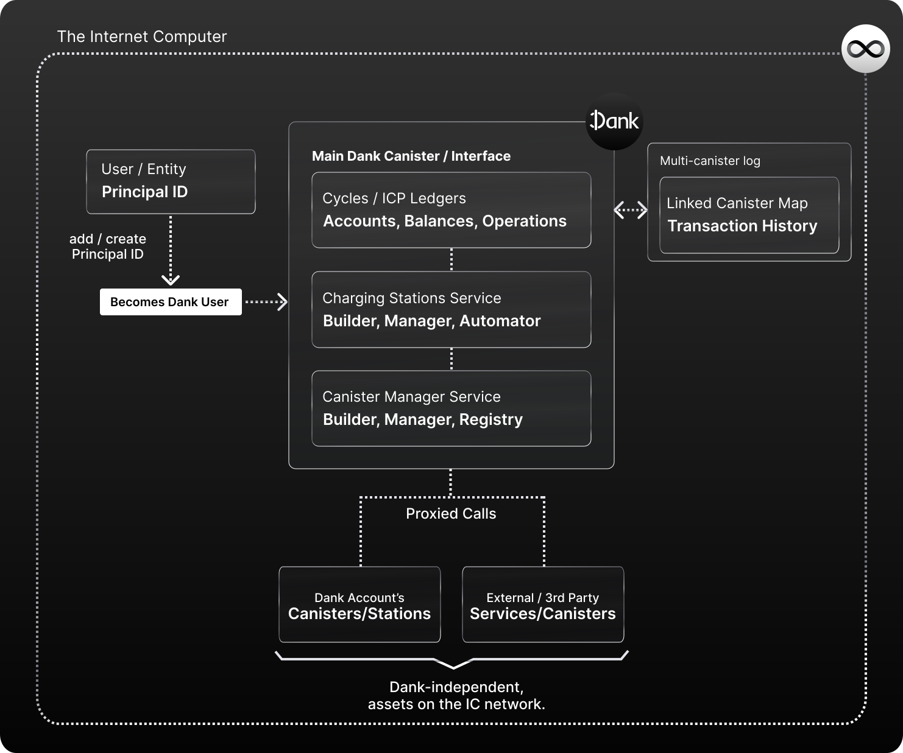

# How Dank Works

Dank is an Open Internet Service and protocol for `cycle-based finances and development` on the Internet Computer. It lives in a tamperproof multi-canister architecture, composed by a main canister, and a sub-set of canisters storing metadata, and transactions records.

In total, the Dank Open Internet Service is composed by these services:

- **The Main Dank Canister**: Dank's primary point of entry for users, and main API interface that orchestrates all other sub-services.
- **The Cycles Ledger API**: First services, in charge of interacting with Dank's Cycles Ledger, giving users a way to perform transactions with their account's balance.
- **The Charging Station API**: Second service, in charge of interacting with Dank's Charging Station framework, a service that abstracts and handles charging station creation for users, allowing them to easily deploy and connect them with their account's cycles/canisters.
- **The Canister Management API**: The final service, that similarly to the previous one, abstracts and handles canister deployment/management for users. It uses **proxied calls** to the Internet Computer to allow users to deploy canisters easily, link them to charging stations, update their WASM files, or send them cycles from their Principal ID. It also provides a **canister registry** that keeps a record of the canisters a user owns/manages, to be surfaced in any app or interface.

The main purpose of Dank is being a decentralized cycles bank that enables Principal IDs to hold and use Cycles (they natively can't do so). It does this by providing **Cycles ledger** that enable `Principal IDs` to hold them using just a Principal ID, without needing a separate Cycles Wallet.

## Converting Principal IDs into the Core of the Internet Computer

By enabling Principal IDs to hold cycles, Dank eliminates the need of managing separate unique identifiers for different assets, merging wallet and identity into one.

Principal IDs are to the Internet Computer what ETH addresses are to Ethereum. They are the user's identity (the only ID an IC app knows from a user), and the only ID that can **own canisters** on the network, which makes them extremely important identifier. We stand strongly with the idea that Principal IDs should be a user’s ‘main account’ on the network. After all, they Web3's leap on experience is being user-centric, and not app/interface/asset centric.

That is why, with Dank, we are abstracting the need of managing token-specific addresses, and are taking a path where, instead of using app-specific Principal IDs or token-specific wallet IDs, we create an ecosystem that allows users to use their Principal ID as their universal account (identity+wallet) across the Internet Computer network.

This approach works best to enable interface-agnostic and non-siloed experiences, like we see on **Dapps & DeFi**; where a user can easily jump from app to app, bringing their assets with them, with no friction or boundaries and enabling great connectivity across services.

Reason why Dank, aside from its Cycles ledger, offers a Canister Registry service. So that users can **keep a record of the canister they own** and automatically surface them in any interface that integrates Dank to manage them.

## An Abstraction Layer for Cycle Related Use Cases

By unifying cycles under `Principal IDs` in the Dank ecosystem, Dank can also provide a **unification and abstraction layer for many cycle related use cases as well. Including, mainly, canister and charging station development**.

All operations involving cycles, for example, from canister and charging station development and deployment, to cycles refill management, and asset transactions across accounts and wallets, are automated, abstracted, and accessible as `simple API calls to the Dank Main Interface`. 

**Therefore Dank creates a seamless connections between users, their cycles, and the use cases they can give to them**.

This is achieved by having the Main Dank Canister orchestrate different services, in charge of abstracting specific use cases (Charging Station development, Canister Management, Cycle-related actions), which are then surfaced via Dank's Main API (main canister interface) as simple to use calls.

## Dank Users, the Core of Dank

As mentioned above, `Principal IDs` using Dank can be called `Dank Users`, and are assigned a balance tied to that ID in Dank's Ledgers, tracked by the protocol using an implementation of `big-map`.

All Dank Users can hold a Cycles balance in the ledger, and interact with the built-in suite of cycle actions and canister developer tools provided either by the Dank API, or surfaced by an integrated interface (as is Fleek.ooo for canister development).

## A Unified Development Environment

**From a developer perspective, Dank provides an unified development environment, and an abstraction layer for integrating or interacting with all of these functionalities.**

By leveraging Dank's developer interfaces/APIs, a developer can integrate Dank's cycles, canister, and charging station features into their applications so that their users can access them in an abstracted, and UI-oriented way.

Developers can also leverage the Dank ecosystem for their own development process; as Dank better help orchestrate all moving pieces and the interactions required to build on the Internet Computer (canisters, cycles, charging stations) through a unified and automation-friendly interface.
