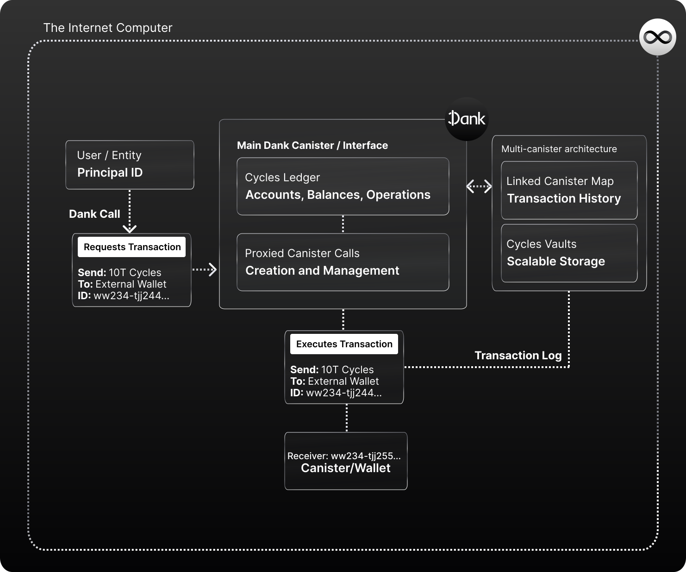

# How Dank Works
## The Open Internet Service for Cycle-based Finances

Dank is an Open Internet Service and protocol for `cycle-based finances and development` on the Internet Computer. It lives in a tamperproof multi-canister architecture, composed by a main canister, and a sub-set of canisters storing metadata, transactions records, and cycles.

!!! info

    Dank is currently in development and this documentation and the initial architecture/scope of Dank might be subject to changes or modifications as that evolves. We'll update this documentation recurrently on our path to V1.

The main purpose of Dank is being a decentralized cycles bank that enables users  to hold and use Cycles with just a Principal ID (they natively can't do so). It does this with the **Cycles ledger**, in which users hold a balance references to their ID. You can think of it as a token ledger for cycles!

However that is one of the perks and services Dank enables to users & developers:

- **The Cycles Ledger**: Dank's main service which allows anyone to hold cycles with just a Principal ID by storing them on Dank's Cycles Ledger trustlessly.
- **Seamless User Onboarding for Apps that surface Cycles**: Dank enables IC apps that want to surface user cycles, or let users interact with cycles, integrate it to authenticate users (and their cycles balances) in one step using only a Principal ID. No need to ask users to specify and authorize a separate Cycles Wallet ID each time to surface their cycles in-app, because they all utilize Dank's universal address.
- **Proxied Canister Management**: Allows users to make **proxied calls** to the Internet Computer to create canisters easily linked to their Principal ID, pay the deployment fee seamlessly from their cycles balance, refill them with cycles from their Dank balance, and manage them using proxied calls through Dank (which will handle all cycles fees).

**Dank uses the same interface as Cycles Wallets** so that its usage is familiar, and compatible with all existing development use cases. It provides the same benefits of Cycles Wallet, abstracting the headaches and issues that managing cycles in a separate address can bring.

## Connecting Cycles to Principal IDs on the Internet Computer

Principal IDs are to the Internet Computer what ETH addresses are to Ethereum. They are the user's identity (the only ID an IC app knows from a user), and **the only ID that can own/control canisters on the network**, which makes them the unique identifier centerpiece of the Internet Computer.

But by the Internet Computer's native standards, they can't hold ICP, Cycles, or other tokens (which require separate identifiers). 

We believe Principal IDs have to take that role as the **Universal Unique Identifier of the Internet Computer** to allow interconnected, composable, user-owned and controlled experiences to thrive easily without sacrificing the user-experience gains of Web3. And we're taking the first step with Dank, by connecting cycles to Principal IDs.

That is why Dank's main service is the **Cycles Ledger**, which allows users to trustlessly hold cycles on the ledger, using just a Principal ID to reference their balance. **The user only needs one identifier (their Principal ID)**, and in turn Dank's Main Canister acts a "Universal Cycles Wallet" for all users.

By enabling Principal IDs to hold cycles, **Dank takes the first step towards eliminating the need to manage separate unique identifiers for different assets and apps**, merging wallet and identity into a single unique identifier (Principal IDs). Users need to worry about one ID, and any service that integrates Dank will know to use Dank's Universal ID to fetch the user's cycles balance.

The most immediate impact and benefit Dank brings will be seen on **development and development platforms on the IC**, because Dank will simplify the experience greatly by making cycle management and their interactions with canisters easier. 

But also, in a world where **IC apps surface cycles features** to users (they already do!), or consumer apps transition to a model where users pay for their own cycles usage (like gas on Ethereum), Dank will help bring the smoothest experience for both users and developers.

## An Abstraction Layer for Cycle Related Use Cases

By unifying cycles under `Principal IDs`, Dank can also provide a **unification and abstraction layer for many cycle related.** The most immediate benefit will be seen on Internet Computer development, since cycles are the key component and fuel of all software on the IC.

All operations involving cycles, for example, from canister creation and deployment, to cycles refill management, and asset transactions across accounts and wallets, can be simplified by Dank's services, and in the future further evolve to cover more complex cases.

**Therefore Dank helps create a seamless and simpler connections between users, their cycles, and the use cases they can give to them**.

This is achieved by having the Main Dank Canister act as a "proxy" for different cycle-related services/actions, like canister creation, to ensure the interactions between cycles and other Internet Computer assets or services. A simpler/abstracted experience for the user, concentrated under a single unique identifier (Principal ID).

## One-step User Onboardings for Apps that Surface Cycles

Without Dank, when interacting with IC applications that can surface cycles or allow users to use them in-app, users would need **to manage two unique identifiers.** One for their identity (Principal ID) and one for their wallet (Cycles Wallet / Canister ID). This is because natively Principal IDs can't hold cycles, and users need a separate canister that acts as their wallet and hold cycles for them.

If you were to log into an IC app like this, **you would have to input your Wallet ID** each time before entering your Principal ID so that the app can authorize your identity to use your cycles balance. This adds several points of friction when onboarding users:

- There are multiple steps in the user's onboarding
- Sending cycles across users (Principal IDs) is not possible, you'd need to know a separate Wallet ID
- In the case of Internet Identity, a user's cycles balance ends up being app-specific

**How does Dank eliminate this friction?** Dank replaces the need for a Cycles Wallet to hold cycles (Principal IDs can't hold them), which is a canisters users need to deploy for the sole purpose of holding cycles.

With the Cycles Ledger, Dank allows users to hold cycles with just a Principal ID, removing the need for a Cycles Wallet. Any IC app that integrates Dank doesn't need to ask and authenticate a user's Wallet ID, because **the Dank canister ID is the same across all users**. Therefore, any IC app that integrates Dank can authenticate a user with just their Principal ID, and knows what Canister ID they need to authorize to surface the user's balance (Dank's Universal Canister ID).

One step, and one unique identifier for both identity and cycles balance. Connecting cycles to Principal IDs is the first step towards enabling **the same composability** users are familiar with in Web3 (and networks like Ethereum), but on the IC.

## Integratable into any IC App

From a developer perspective, **Dank can be easily integrated into their services/app experiences** to surface all of these functionalities for their users.

By leveraging Dank's interfaces/APIs, a developer can integrate Dank's cycles, canister, and other features so that their users can access them via an integrated UI/web app; for example, to create Dank-powered cycle finance apps, or simply to enable users to send/receive/operate with cycles in-app with just a Principal ID.