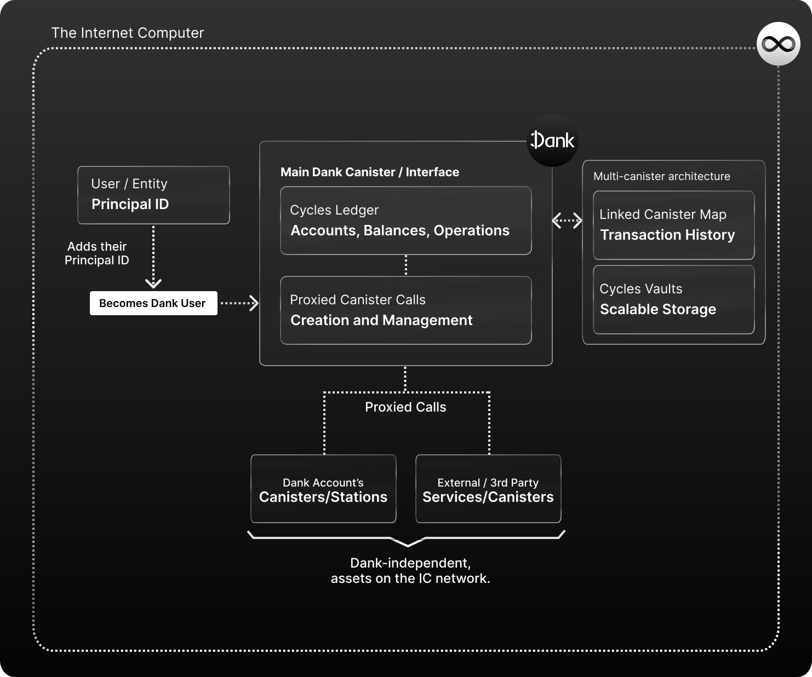
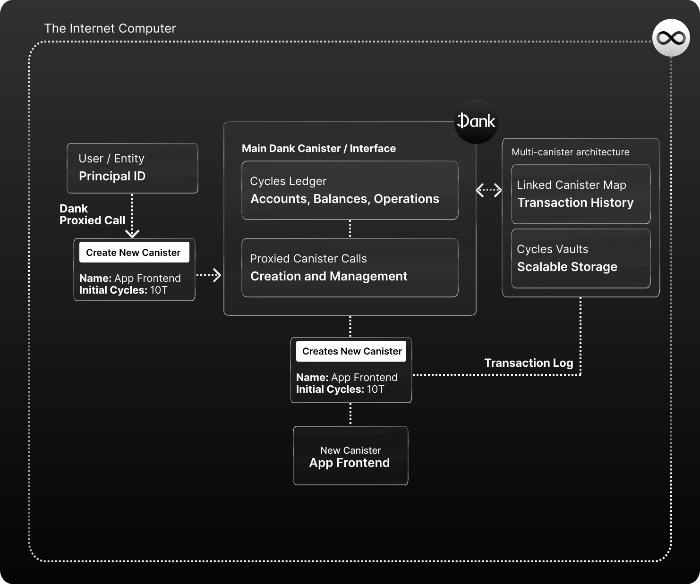
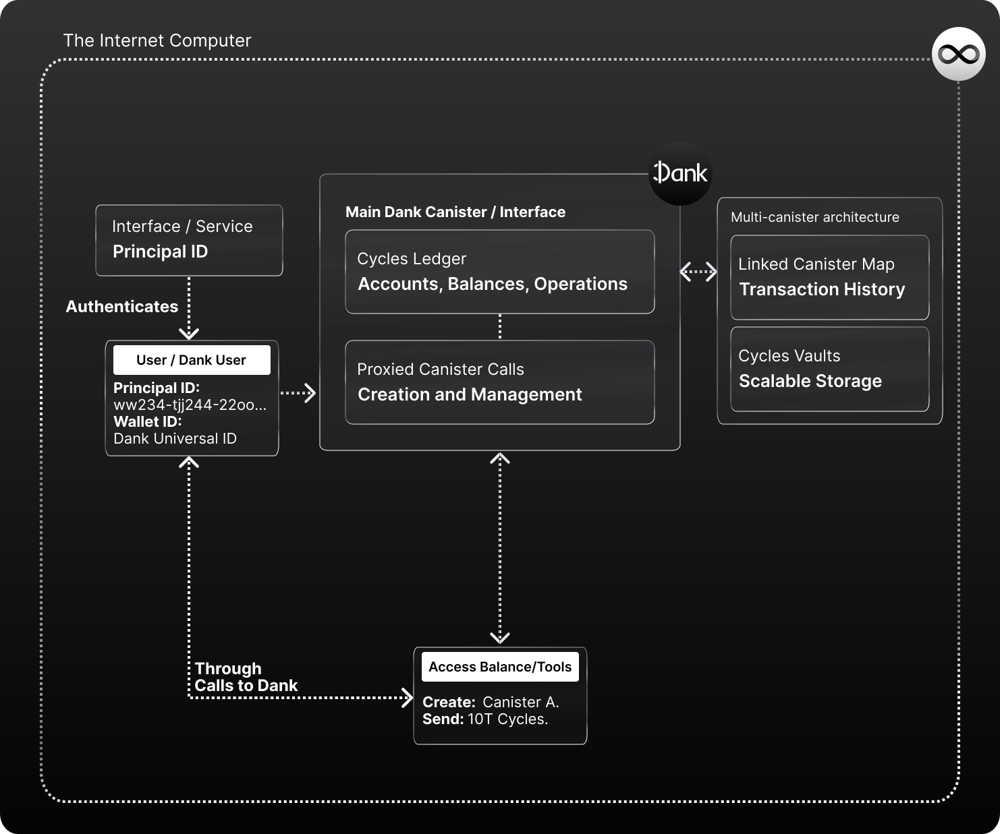

# How Dank Works

Dank is an Open Internet Service and protocol for `cycle-based finances and development` on the Internet Computer. It lives in a tamperproof multi-canister architecture, composed by a main canister, and a sub-set of canisters storing metadata, transactions records, and cycles.

The main purpose of Dank is being a decentralized cycles bank that enables users  to hold and use Cycles with just a Principal ID (they natively can't do so). It does this with the **Cycles ledger**, in which users hold a balance references to their ID. You can think of it as a token ledger for cycles!

However that is one of the perks and services Dank offers to users & developers:

- **The Cycles Ledger**: Dank's main service which allows anyone to hold cycles with just a Principal ID by storing them on Dank's Cycles Ledger trustlessly.
- **Seamless User Onboarding**: Dank enables IC apps that integrate it to authenticate users (and their cycles balances) in one step, using only a Principal ID. No need to ask users to specify and authorize a separate Cycles Wallet ID each time to surface their cycles in-app, because they all utilize Dank's universal address.
- **Proxied Canister Management**: Allows users to make **proxied calls** to the Internet Computer to create canisters easily linked to their Principal ID, pay the deployment fee seamlessly from their cycles balance, refill them with cycles from their Dank balance, and manage them using proxied calls through Dank (which will handle all cycles fees).

## Converting Principal IDs into the Core of the Internet Computer

By enabling Principal IDs to hold cycles, **Dank begins to eliminate the need of managing separate unique identifiers for different assets and apps**, merging wallet and identity into a single unique identifier.

Cycles are just the beginning. After V1, we will be looking to create a Principal ID based ICP ledger to **do the same abstraction for ICP, eliminating the need for a separate identifier (Account IDs) to hold them**, which is the current situation.

Principal IDs are to the Internet Computer what ETH addresses are to Ethereum. They are the user's identity (the only ID an IC app knows from a user), and **the only ID that can own/control canisters on the network**, which makes them the unique identifier centerpiece of the Internet Computer.

But by the Internet Computer's native standards, they can't hold ICP, Cycles, or other tokens (which require separate identifiers). 

We believe Principal IDs have to take that role as the **Universal Unique Identifier of the Internet Computer** to allow interconnected, composable, user-owned and controlled experiences to thrive easily without sacrificing the user-experience gains of Web3.

This approach works best to enable interface-agnostic and interconnected experiences, like we see on **Dapps & DeFi**; where a user can easily jump from app to app, bringing their assets with them. No friction or boundaries.

## An Abstraction Layer for Cycle Related Use Cases

By unifying cycles under `Principal IDs` in the Dank ecosystem, Dank can also provide a **unification and abstraction layer for many cycle related use cases as well. Including,  canister development**.

All operations involving cycles, for example, from canister creation and deployment, to cycles refill management, and asset transactions across accounts and wallets, can be simplified by Dank's services, and in the future further evolve to cover more complex cases.

**Therefore Dank helps create a seamless and simpler connections between users, their cycles, and the use cases they can give to them**.

This is achieved by having the Main Dank Canister act as a "proxy" for different cycle-related services/actions, like canister creation, to ensure the interactions between cycles and other Internet Computer assets or services. A simpler/abstracted experience for the user, concentrated under a single unique identifier (Principal ID).

**Reference Implementation:**
[Fleek.ooo](https://fleek.ooo/) is a platform that leverages Dank's features to provide an Open Internet Service around development on the Internet Computer; where by abstracting the creation and management process for canisters/charging stations, it simplifies how developers can build and host apps, infrastructures, websites, or databases on the Internet Computer.

## One-step User Onboardings

**How is this enabled by Dank?** Dank replaces the need for a Cycles Wallet to hold cycles (Principal IDs can't hold them), which is a canisters users need to deploy for the sole purpose of holding cycles.

Without Dank, when interacting with IC applications that can surface cycles, users would need to manage two unique identifiers. One for their identity (Principal ID) and one for their wallet (Cycles Wallet / Canister ID). 

If you were to log into an IC app like this, **you would have to input your Wallet ID** each time before entering your Principal ID so that the app can authorize your identity to use your cycles balance. This adds several points of friction when onboarding users:

- Multiple steps in the user's onboarding
- Sending cycles across user identities (Principal IDs) is not possible
- In the case of Internet Identity, balances also end up being app-specific

With the Cycles Ledger, Dank allows users to hold cycles with just a Principal ID, removing the need for a Cycles Wallet. Any IC app that integrates Dank doesn't need to ask user's for their Wallet ID, because **the the Dank canister ID is the same across all users**. Therefore, any IC app that integrates Dank can authenticate a user with their Principal ID, and knows what Canister ID they need to authorize to surface the user's balance.

One step, one unique identifier, and the same identity/balances across all interfaces.

**Reference Implementation:**

[Plugwallet.ooo](https://plugwallet.ooo/) is a browser wallet / identity / authentication provider that uses Dank, and any platform will be able to integrate to enable a seamless one-step authentication flow in IC browser experiences. By integrating Plug, you can easily authenticate Principal IDs and surface their balances in-app (and trigger transactions) in one seamless step.

## Integratable into any IC App

**From a developer perspective, Dank can be easily integrated into their services/app experiences to surface all of these functionalities for their users.** 

By leveraging Dank's interfaces/APIs, a developer can integrate Dank's cycles, canister, and other features/services so that their users can access them via an integrated UI/web app; for example, to create Dank-powered cycle finance apps, or simply to enable users to send/receive/operate with cycles in-app with just a Principal ID.