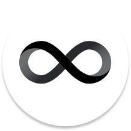
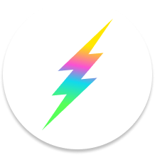
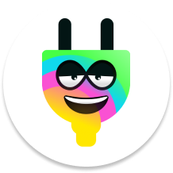

# Dank App Ecosystem

Meet the Dank-est apps. These are the first applications that are leveraging (or will soon integrate!) Dank's services (like XTC) to offer seamless cycles, canister, and onboarding experiences on the Internet Computer!

| Logo  	| Name  	| Description |
|---	|---	| ---	|
|  	|   <a href="https://dfinity.org/cycles" target="_blank">Cycle Faucet</a>	| Faucet tool that provides a one-time redeem of $100 worth of cycles to new developers on the Internet Computer. Users will be able to redeem their cycles as Dank's XTC Cycles token.|
|  	|   <a href="https://fleek.ooo" target="_blank">Fleek.ooo (Coming Soon)</a>	| **Coming Soon!**. Canister and cycles management platform for deploying frontend, backend, infrastructure, or any kind of canister on the Internet Computer and manage their cycles via a simple, seamless interface. |
|  	|   <a href="https://plugwallet.ooo" target="_blank">Plug Wallet</a>	| **Integration coming Soon!** Wallet and authentication provider. Plug is a browser extension that allows you to surface your ICP, and soon cycles or any other IC token's balance, as well as log into IC applications using your Principal ID. |