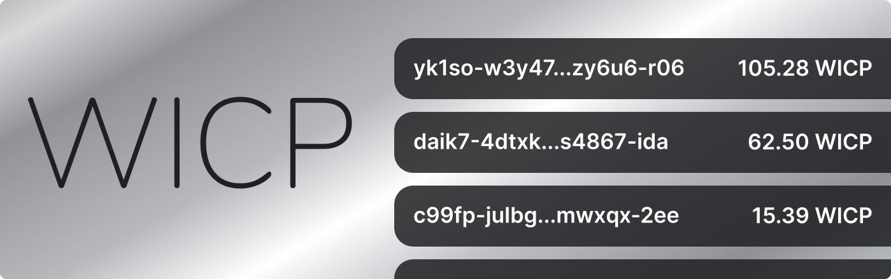

# Cycles Token (XTC) - Getting Started



Wrapped ICP (WICP) is a Dank’s wrapped version of the Internet Computer’s native ICP token.  Wrapped ICP (WICP) is built on a Principal ID centric infrastructure. This means that the WICP canister tracks balances at its ledger against a user's Principal ID.

While the interaction methods on Wrapped ICP may be different from ICP, each Wrapped ICP is backed 1:1 by ICP, resulting in WICP and ICP always maintaining the exact same value.

Users can wrap their ICP by sending it to the WICP canister and will subsequently be credited a balance against their Principal ID equal to the amount of ICP that was sent to be wrapped.

Unwrapping WICP burns the WICP tokens and sends an amount of ICP equal to the amount of WICP burned to the Principal ID who initiated the unwrap.

- Wrapped ICP (WICP) Canister ID: {{ canister ID here }}
- [Review the code on Github](https://github.com/psychedelic/wicp)
- [Visit our website](https://dank.ooo/)
- [DIP20 Standard](https://github.com/Psychedelic/DIP20)

## Available Features & Methods 

These are the features and methods that are built into the Wrapped ICP (WICP) canister and available to be used publicly.

- **Depositing ICP** (sending ICP to the WICP canister, minting WICP on a 1:1 basis to the senders balance)
- **Checking your WICP balance** (asking the WICP canister for your balance)
- **Sending WICP** (sending WICP from one Principal ID to another)
- **Withdrawing ICP** (burning your WICP, sending ICP on a 1:1 basis to the withdrawers balance at the ICP ledger)
- **Setting an allowance** (a value that you enable a third party to spend on your behalf)

---

## 🧰 Interacting with Wrapped ICP (WICP) - On Mainnet (DFX)

In order to interact with the Internet Computer mainnet version of the Wrapped ICP (WICP) canister, you need the address.

WICP Address: {{ ADDRESS GOES HERE }}

You have to use this address to make your calls.

---

## ✒️ Update Calls
The update calls described in this section charge a fee amount of tokens to prevent DDoS attacks, this is necessary because of the reverse gas model of the Internet Computer.

All update functions are allowed to trap, instead of returning an error in order to take advantage of the canisters automatic, atomic state rollback.

The cost of the fee is {FEE GOES HERE}. This fee is not for financial benefit, but to cover the cost of computation on the Internet Computer.

---

### Deposit ICP to mint an WICP balance - mint

Minting WICP happens in a 1:1 ratio with the amount of ICP you deposit. Ex) Deposit 5 ICP → 5 WICP Minted. Once deposited, the ICP is locked into the WICP canister, and the WICP balance is tied to the Principal ID entered.

When calling the Mint method, there are a few steps that must be followed. 

**First, make a transfer of ICP to the WICP canister** (id: {{ canister ID HERE }}). After the transaction is accepted, pass the block height of your transaction as a parameter. 

```bash
dfx ledger --network ic transfer --amount value "bd93b82d61f5e7e69a36cfc5391c990341a9c88412a911f663bd01f1aaece0e7" --memo 0
```

**Next, pass the index of the sub-account related to the Principal ID you made the Mint call with**. 

You can pass ‘None’ to default to the main account (index 0), or specify the index by number. Mint checks the block at the NNS Ledger canister that you indicated to see if there is a transaction that matches the Principal ID that you’ve made the Mint call with. If found, it credits your balance with the amount found in the ICP transaction.

```bash
dfx canister --no-wallet --network ic call wicp_rs mint '(subaccount, blockheight:nat64)'
```

---

### Unwrap your WICP and regain a balance of ICP - withdraw

Calling withdraw unwraps your WICP, burns it, and then unlocks and sends ICP from the WICP canister to the balance of the Principal ID you specify.

The Withdraw method takes two parameters, ‘value’ and ‘to’. Value is an integer that represents the amount of WICP you’d like to withdraw to ICP. To is a string that should be the Principal ID that you wish the ICP to be transferred to. 

```bash
dfx canister --no-wallet --network ic call wicp_rs withdraw '(value:nat64, "account id")'
```

---

### Transfer WICP to Another WICP Balance - transfer

You can transfer WICP to any other valid Principal ID. Your balance at the WICP ledger will be deducted and the Principal ID you transfer to, will be incremented.

Transfers ‘value’ (Nat) amount of tokens to user ‘to’ (Principal), returns a TxReceipt which contains the transaction index or an error message.

```bash
dfx canister --network=ic --no-wallet call {{ canister ID here }} transfer "(principal \"to-account-principal\", 1000:nat)"
```
---

### Set an Allowance to Another Identity - approve

You can set an allowance using this method, giving a third-party access to a specific number of tokens they can withdraw from your balance if they want.

An allowance permits the ‘spender’ (Principal) to withdraw tokens from your account, up to the ‘value’ (Nat) amount. If it is called again it overwrites the current allowance with ‘value’ (Nat). There is no upper limit for value, you can approve a larger value than you have, but 3rd parties are still bound by the upper limit of your account balance.

```bash
dfx canister --network=ic --no-wallet call {{ canister ID here }} approve "(principal \"third-party-principal-id\", 1000:nat)"
```

---

### Transfer WICP on Another User's Behalf - transferFrom
Transfers ‘value’ (Nat) amount of tokens from user ‘from’ (Principal) to user ‘to’ (Principal), this method allows canister smart contracts to transfer tokens on your behalf, it returns a TxReceipt which contains the transaction index or an error message.

```bash
dfx canister --network=ic --no-wallet call {{ canister ID here }} transferFrom "(principal \"from-account-principal\",principal \"to-account-principal\", 1000:nat)"
```
---

## 📡 Query Calls
The query calls in this section do not require any fee as they are only reading information, not modifying it.

### Check your Balance - balanceOf
Returns the balance of user `who`.

```bash
​​dfx canister --network=ic --no-wallet call --query {{CANISTER ID HERE}} balanceOf "(principal \"who-account-principal\")"
```

---

### Check the set allowance for an ID - allowance
Returns the amount which spender is still allowed to withdraw from owner.

```bash
dfx canister --network=ic --no-wallet call --query {{CANISTER ID HERE}} allowance "(principal \"owner-account-principal\", principal \"spender-account-principal\")"
```

### Get token logo - getLogo 
Returns the logo of Wrapped ICP (WICP).

```bash
dfx canister --network=ic --no-wallet call --query {{CANISTER ID HERE}} logo
```

---

### Get token name - name
Returns the name of Wrapped ICP (WICP).

```bash
dfx canister --network=ic --no-wallet call --query {{CANISTER ID HERE} name
```

---

### Get token symbol - symbol
Returns the symbol of the token.

```bash
dfx canister --network=ic --no-wallet call --query {{CANISTER ID HERE} symbol
```

---

### Get token decimals - decimals
Returns the decimals of the token.

```bash
dfx canister --network=ic --no-wallet call --query {{CANISTER ID HERE} decimals
```
 
---

### Get total supply of token - totalSupply
Returns the total supply of the token.

```bash
dfx canister --network=ic --no-wallet call --query {{CANISTER ID HERE} totalSupply
```

---

### Get token’s metadata - getMetadata
Returns the metadata of the token.

```bash
dfx canister --network=ic --no-wallet call --query {{CANISTER ID HERE} getMetadata
```

---

### historySize
Returns the history size.

```bash
dfx canister --network=ic --no-wallet call --query {{CANISTER ID HERE} historySize
```