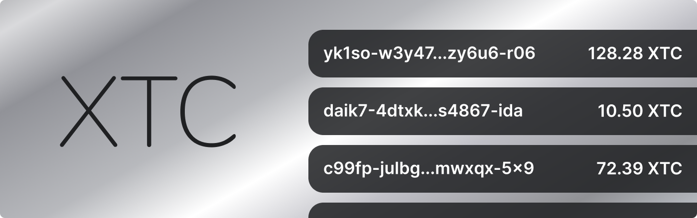

# Cycles Token (XTC) - Getting Started



Time to start using the Cycles Token (XTC)! Here you will find all currently available methods to interact with the XTC Token Canister, and perform:

- Ledger Operations (Deposit, Send, Withdraw, Check balances...)
- Proxy Canister Calls (Create Canister, Make Proxy Call to Canisters)

## 🧰 Interacting with Cycles Token (XTC) - On Mainnet (DFX)

Cycles Token (XTC) offers its services on the mainnet of the Internet Computer (IC). The XTC Token Canister ID on mainnet is `aanaa-xaaaa-aaaah-aaeiq-cai`. **You have to use this address for your calls**.

### 🚨 Important: Formatting for XTC Values/Amounts in Calls

1 XTC represents one trillion cycles (1,000,000,000,000). In frontends, and integrated UIs, we use the friendlier format with decimals (no zeroes, 1 XTC = 1 trillion cycles -- 0.5 XTC == 0.5 TC).

But, for our **APIs and interfaces**, we utilize the **standard full numerical value of raw cycles** that XTC represents (1XTC = 1000000000000) to maintain accuracy and consistency with the development cycles/DFX experience. This is the example amount format you will see on the methods/calls below. So, to transfer 1 XTC, in the call you would specify 1000000000000, not 1.

---

## 📓 Ledger Operations
These are all the operations related to interacting, using, and trading with your Cycles Token balance in the XTC Token Canister.

### ✒️ Update Calls
The update calls described in this section charge a fee amount of tokens to prevent DDoS attack, this is necessary because of the reverse gas model of the IC. 

All update functions are allowed to trap, instead of returning an error in order to take advantage of the canisters automatic, atomic state rollback.

The cost of the fee is not for financial benefit, but to cover the cost of computation on the IC.

---

### Mint (Deposit cycles to mint an XTC balance)

You can get your first Cycles Token (XTC) balance by either depositing cycles to the XTC Token Canister to mint them (see below), or getting a one-time redeem of 100$ worth of cycles from DFINITY's [Cycles Faucet tool](https://faucet.dfinity.org/), selecting the option to redeem them as Dank's Cycles Token (XTC)! 

(**If you used the faucet already**, and chose the Cycles Wallet option but want to migrate to Cycles Tokens (XTC) [see this example](#sending-your-faucet-cycles-wallet-balance-to-cycles-token-xtc).)

#### Depositing from a personal Cycles Wallet

You can deposit cycles into the XTC canister from a personal cycles wallet directly. The cycles are locked in the XTC canister to "mint" your 1-1 Cycles Token (XTC), tied to your Principal ID. To send cycles from a personal cycle wallet it must be deployed to a public subnet on mainnet, it must have cycles and be set as the wallet against dfx. In the following `mint` command the AMOUNT to deposit is in cycles (You should change the amount). 

```bash
$ dfx canister --network=ic --wallet=$(dfx identity --network=ic get-wallet) call --with-cycles AMOUNT aanaa-xaaaa-aaaah-aaeiq-cai mint "(principal \"$(dfx identity get-principal)\")"
(variant { Ok = 3 })
```

NOTE: You can deposit cycles to another XTC balance from your identity with the same `mint` method that we used to deposit cycles to our own XTC balance. For that situation, you should change the argument to a principal ID:

```bash
$ dfx canister --network=ic --wallet=$(dfx identity --network=ic get-wallet) call --with-cycles AMOUNT aanaa-xaaaa-aaaah-aaeiq-cai mint "(principal \"Some-Principal-ID\")"
(variant { Ok = 4 })
```

Note: This command should not require the `--wallet` flag, but we need the `--wallet` to make `--with-cycles` work. This is a known DFX bug.

#### Sending your Faucet Cycles Wallet Balance to Cycles Token (XTC)

Did you use DFINITY's Cycles Faucet tool, but selected the Cycles Wallet to receive your redeem? Want to move that balance to Cycles Token (XTC?). **If you have ```bc``` installed** you can do this quick command.

(Make sure you set your cycles wallet as your default dfx wallet first)

```bash
dfx canister --network=ic --wallet=$(dfx identity --network=ic get-wallet) call --with-cycles $(echo "$(dfx wallet --network=ic balance | cut -d' ' -f1)-10000000000" | bc) aanaa-xaaaa-aaaah-aaeiq-cai mint "(principal \"$(dfx identity get-principal)\")"
```

---


### Burn (Withdrawing cycles to a Canister)

Unwraps Cycles Token (XTC) into raw Cycles to send them to a Canister ID. (You should change the amount)

```bash
$ dfx canister --network=ic --no-wallet call aanaa-xaaaa-aaaah-aaeiq-cai burn "(record { canister_id= principal \"some-canister's-principal-id\"; amount= (2000:nat64)})"
(variant { Ok = 1 })
```

---

### transferErc20 (Transfer XTC to another XTC Balance)
Send Cycles Token (XTC) to a Principal ID, balances change internally on the XTC ledger. (You should change the amount).

Transfers `value` amount of tokens to user `to`, returns a `TxReceipt` which contains the transaction index or an error message.


```bash
DFX code example / daniel
```

---

### transferFrom (Transfer XTC to another XTC Balance on Another's Behalf)

Transfers `value` amount of tokens from user `from` to user `to`, this method allows canister smart contracts to transfer tokens on your behalf, it returns a `TxReceipt` which contains the transaction index or an error message.

```bash
DFX code example / daniel
```

---

### approve (Set an Allowance to Another Identity)

You can set an allowance using this method, giving a third-party access to a specific number of tokens they can withdraw from your balance if they want.

An allowance permits the `spender` to withdraw tokens from your account, up to the `value` amount. If it is called again it overwrites the current allowance with `value`. There is no upper limit for value.

```bash
DFX code example / daniel
```

---

### getTransaction (Check Details of a Transaction)

Returns transaction detail of the transaction identified by ´index´. If the ´index´ is out of range, the execution traps. Transactions are indexed from zero.

```bash
DFX code example / daniel
```

### getTransactions (Check Details of Several Transactions)

Returns an array of transaction records in the range `[start, start + limit)`. To fend off DoS attacks, this function is allowed to trap, if limit is greater than the limit allowed by the token. This function is also allowed to trap if `start + limit > historySize()`.


```bash
DFX code example / daniel
```

---

### 📡 Query Calls (Checking balances, allowances, and metadata)

### balanceOf

Returns the balance of user `who`.

```bash
DFX code example / daniel
```

### allowance

Returns the amount which `spender` is still allowed to withdraw from `owner`.

```bash
DFX code example / daniel
```

### logo

Returns the logo of the Cycles Token (XTC).

```bash
DFX code example / daniel
```

### name

Returns the name of the token.

```bash
DFX code example / daniel
```

### symbol

Returns the symbol of the token.

```bash
DFX code example / daniel
```

### decimals

Returns the decimals of the token.

```bash
DFX code example / daniel
```

### totalSupply

Returns the total supply of the token.

```bash
DFX code example / daniel
```


### getMetadata

Returns the metadata of the token.

```bash
DFX code example / daniel
```

### historySize

Returns the history size.

```bash
DFX code example / daniel
```

---
## 🔋 Create and Manage Canisters

You can create canisters using your Cycles Token (XTC) balance. This is, however, a low level api, if you want to deploy your canister using your XTC balance see [Using dfx deploy with Cycles Token](#using-dfx-deploy-with-cycles-token-xtc).

Using `wallet_create_canister` method, you can create a canister and set the controller of
the canister to a principal ID you want. If you leave the controller to be `null`, you will be automatically selected as the controller of the newly created canister. Using the `cycles` parameter, it is possible to deposit cycles to your new canister from your XTC balance.

```bash
$ dfx canister --network=ic --no-wallet call aanaa-xaaaa-aaaah-aaeiq-cai wallet_create_canister "(record {cycles= (AMOUNT:nat64); controller= (null); })"
(
  variant {
    17_724 = record { 1_313_628_723 = principal "CREATED_CANISTER_ID" }
  },
)
```

To check the status of the created canister run the dfx canister `status` command with the returned `CREATED_CANISTER_ID`:

```bash
dfx canister --network=ic --no-wallet status CREATED_CANISTER_ID
```

---

### Proxy canister calls with XTC:

XTC allows you to proxy all of your `dfx` calls through it so your Cycles Token (XTC) balance is used to fund the operations (the XTC canister unwraps them to raw cycles). To use this feature, you should use the `wallet_call` method. This method accepts four arguments:

  - canister: principal -> Your target canister
  - method_name: text -> The method you want to call from that canister
  - args: blob -> The arguments you should pass to for the call
  - cycles: nat64 -> The amount of cycles you want to pass

Let's proxy a call to the Piggy Bank canister's `whoami` method (an example canister we deployed to show an example of a proxy call!). We expect this method to return our XTC balance's ID:

```bash
dfx canister --network=ic call aanaa-xaaaa-aaaah-aaeiq-cai wallet_call "(record { canister= principal \"dmj37-5iaaa-aaaad-qakya-cai\"; method_name= \"whoami\"; args= blob \"DIDL\01nh\01\00\00\"; cycles= (0:nat64); })"
```


## ✅ Set Cycles Token (XTC) as your default wallet in dfx:

The dfx cli tool provides helper functions during development that consumes cycles from your wallet. You can set the XTC canister to be used for these functions.

```bash
dfx identity --network=ic set-wallet aanaa-xaaaa-aaaah-aaeiq-cai --force
```

### Using dfx deploy with Cycles Token (XTC):

The `dfx deploy` command shows an error when deploying within a dfx project when the cycle wallet is set as the `XTC` canister. The `deploy` command successfully creates the canister, but fails when installing the wasm code (this is due to dfx assuming the controller of the new canister is the cycle wallet, not the dfx identity).

To deploy a projects canisters, instead of `dfx deploy --network=ic` separate the canister and install commands:

```bash
dfx canister --network=ic create --all
dfx deploy --network=ic --no-wallet
```

As an example of setting up and deploying a new project once dfx has been installed:

```bash
# Set XTC as the dfx cycle token
dfx identity --network=ic set-wallet aanaa-xaaaa-aaaah-aaeiq-cai --force

# Create a new dfx project
dfx new example

# move into the project directory
cd example

# install the node.js dependencies
npm install

# Create the empty canisters on mainnet
dfx canister --network=ic create --all

# Install the code into the empty canisters on mainnet
dfx deploy --network=ic --no-wallet
```

---

## 🚨 Deprecated Methods

The XTC token previously utilized a different token standard interface [(see it here)](https://github.com/Psychedelic/standards/tree/main/standards/token-interface). **However, we have begun a migration to a new standard/interface** that follows a closer approach to ERC20, providing a well-known and familiar interface (with an allowances feature), including the extended functionalities XTC has (interacting with canisters, proxy calls, etc.).

During this transition, we deprecated **older methods following the previous standard**. They are still supported when interacting with XTC, but we are leaving a 2 months grace period to update integrations before deprecating them from the canister entirely.

These methods are:

### Check your balance on Cycles Token (Deprecated):

```bash
$ dfx canister --network=ic --no-wallet call aanaa-xaaaa-aaaah-aaeiq-cai balance "(null)"
(0)
```

The reason that we passed `null` as a parameter to the balance method is that we want to check our own balance. If we wanted to check
another account's balance, **we would've added a principal ID there**. In that scenario, the command would have changes to this
(the principal ID used in the command is not real, just an example):

```bash
$ principalID="q6d6b-7t7pe-wdoiw-wjwn7-smnub-aaflq-cjd6i-luoec-gqtg3-62hiy-7qe"
$ dfx canister --network=ic call aanaa-xaaaa-aaaah-aaeiq-cai balance "(principal \"$principalID\")"
(0)
```

### Transferring cycles to another XTC balance (Deprecated)
Send Cycles Token (XTC) to a Principal ID, balances change internally on the XTC ledger. (You should change the amount)

```bash
$ dfx canister --network=ic --no-wallet call aanaa-xaaaa-aaaah-aaeiq-cai transfer "(record { to= principal \"some-account's-principal-id\"; amount= (1000:nat64) })"
(variant { Ok = 2 })
```
