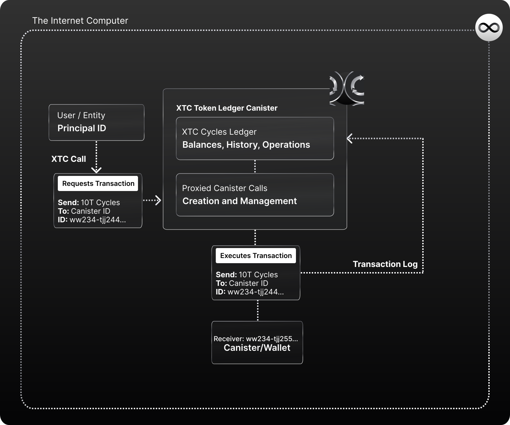
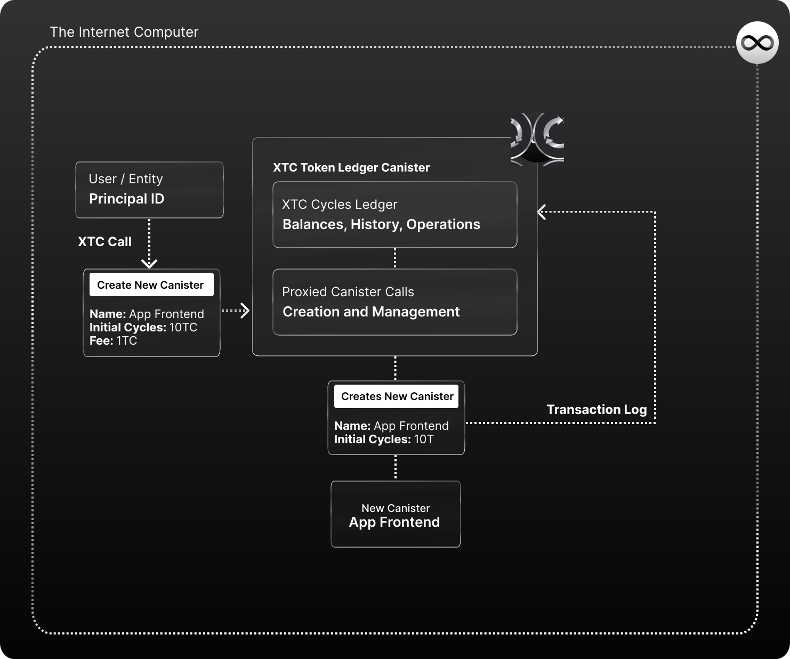

# XTC - The Cycles Token


The Cycles Token (XTC) is Dank's first product. A cycles ledger canister that provides users with a “wrapped/tokenized” version of cycles (XTC) **that can be held with just a Principal ID** (no need for a Cycles Wallet).

**XTC also has the same built-in developer features and functionality as the Cycles Wallet** (built into the XTC token itself) so that it can used to **create and manage canisters through proxy calls, or develop in DFX** funding the cycles fees from your XTC Cycles Token balance.

Each XTC token represents and is backed **1-to-1 with 1 Trillion Cycles (1 XTC = 1 Trillion Cycles)**  that they can hold, utilize, pay for computation, and trade with just like with any other token, tied to their Principal ID (and only requiring a Principal ID).

- XTC Cycles Token Canister ID: ```aanaa-xaaaa-aaaah-aaeiq-cai```
- [View Canister on IC Rocks](https://ic.rocks/principal/aanaa-xaaaa-aaaah-aaeiq-cai)
- [Review the Code on our GitHub](https://github.com/Psychedelic/dank/tree/main/xtc)
- [Visit our Website for more Details](https://dank.ooo/xtc/)
- [Visit our Website for more Details](https://dank.ooo/xtc/)


!!! Important

    Dank's XTC Cycles token is an Alpha product and is in active development. During this testing/development period, the Dank core team will have control over the canister's upgradeability and the "stop/halt" feature to facilitate bug and security updates, prevent malicious acts, and grow the Main Dank Canister in features. 
    
    When the project reaches a level of maturity, it will transition towards a fully community-owned governance system.

## Available Features & Methods  :

As of V0's Alpha release, these are the features that are built-into the XTC Cycles Token ledger/canister, and available as methods to be called.

- **Depositing cycles** (sending cycles to XTC, getting a 1-1 balance).
- **Checking your balance** (asking XTC ledger for your cycles balance).
- **Transferring cycles** (transfer cycles internally to other XTC users).
- **Withdrawing cycles** (send cycles externally, to a Canister ID).
- **Transaction history** (basic linear history of transactions).
- **Creating canisters** (proxy call to create a canister using your XTC balance).
- **Proxied canister calls** (create canisters, make calls to canisters, topping calls -or not- with cycles in XTC).

## The XTC Cycles Token Ledger


The XTC Cycles Token was built following a Principal-ID centric token standard [(Repository)](https://github.com/Psychedelic/standards) where users deposit cycles and get a 1-1 balance of XTC (1 XTC = 1 Trillion Cycles). It is an **alternative to using Cycles Wallet in terms of using and accessing cycles on the Internet Computer**.

You can learn the main differences between using XTC and a Cycles Wallet [in this article](https://medium.com/@dank_ois/b9a1d3ddcebe?source=friends_link&sk=0d4c790eda6883d1c013b10cdb8f89f4).

Just like the Cycles Wallets, the XTC Cycles Token is a **cycles provider for development on the IC**. It was built using the same interface as Cycles Wallet and has built-in proxy-call methods to create and manage canisters.

One important difference is that with XTC, instead of having a per-user Cycles Wallet ID, all XTC users share the same **“Universal ID” (XTC ledger canister ID)** that they can set as their Wallet IDs. Which means users -and developers- don't need to worry about authenticating multiple unique identifiers, and focus on just Principal IDs (since any app that integrates XTC would know what Wallet ID they need to authorize for the user!):

That abstraction is what enables a lot of amazing experience benefits:

- Better DeFi/Dapp compatibility (easier to integrate, access, and send cycles.)
- Smoother onboarding of users & their cycles (no need to authenticate separate Cycles Wallets)
- Composability across apps that surface cycles (one ID to surface the same balance)
- Friendlier format for GUIs (1 XTC = 1,000,000,000,000 cycles = 1$ approx)
- But standard format on APIs/CLI for development (1,000,000,000,000 XC)

Meaning XTC **has the same development perks and features of Cycles Wallet, but with a better compatibility for DeFi/Dapp experiences**.


## Canister Development & Proxy Calls


The XTC Cycles Token is **DFX compatible and has built-in functions that allow users to call the XTC Token canister to create, fund, or make proxy calls** to canisters on the Internet Computer using their XTC cycles balance.

Make the canister calls directly to XTC to execute, or use your XTC wallet in DFX just like a Cycles Wallet. The difference between the two is when you set your default-wallet on the DFX CLI, you just put XTC’s Token's Canister ID instead of a personal Cycles Wallet ID.

This way, XTC can not only allow developers to user their Cycles Token to fund their development (just like with Cycles Wallets); but also offer those features as "plug-n-play" features that any interface can leverage.
